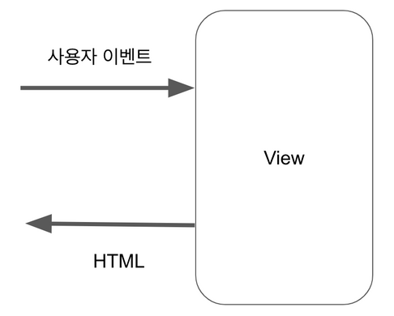
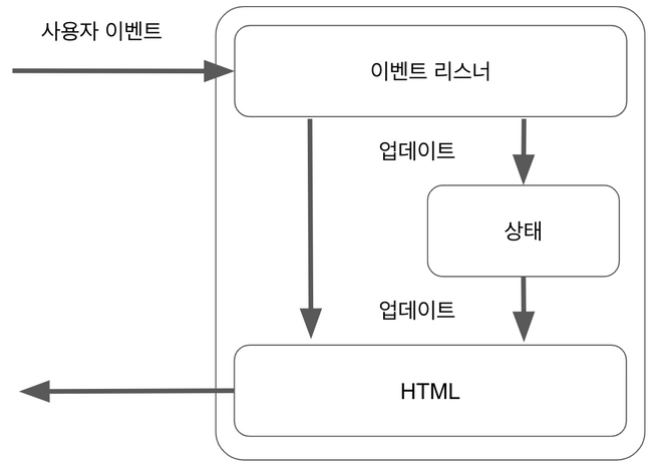
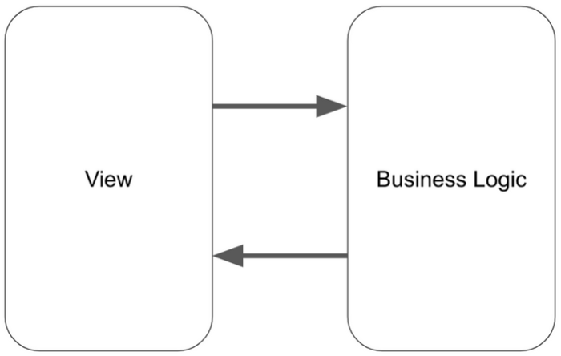
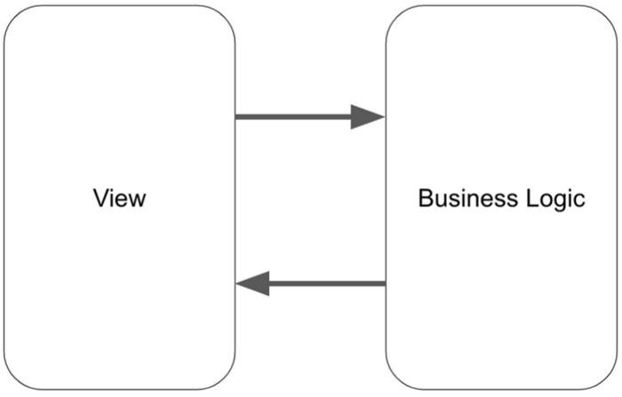
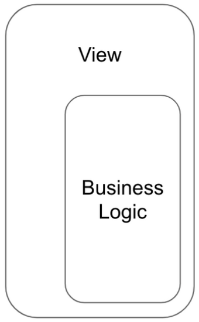
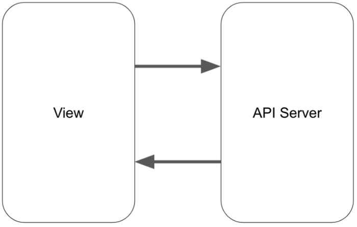
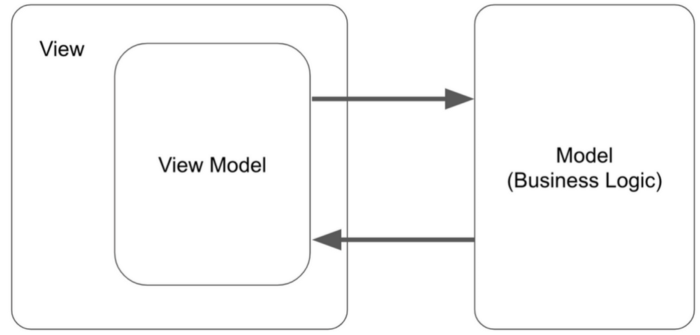

<!DOCTYPE html> <html> 	<head> 		<meta charset=

# 프론트엔드 아키텍처: Business Logic의 분리


# 왜 프론트엔드 아키텍처에 관심을 가져야 할까?

우린 왜 프론트엔드 아키텍처에 관심을 가져야 할까요? 프론트엔드 프로젝트는 충분히 복잡하기 때문입니다. 복잡하다는 것은 개발자가 프론트엔드 프로그램을 살펴볼 때 인지적인 한계에 부딪히게 된다는 사실을 의미하고, 이 사실은 개발을 진행할 때 뿐만 아니라 유지보수를 진행하는 데 비용을 증가시킵니다.

이런 문제를 해결하기 위해 우린 잘 설계된 프로그램을 만들어야 합니다. 잘 설계되어 있다는 건 ‘한 번에 한 부분을 제대로 집중할 수 있게 프로그램을 구성하는 것’ 그리고 ‘재치 있는 설계가 아닌 간단하고 이해하기 쉽게 구성하는 것’을 의미합니다. 즉, 관심사를 잘 분리하고 코드를 잘 이해할 수 있게 만들어야 합니다.

우린 이렇게 프로그램을 설계하는 데 ‘아키텍처’라는 방법을 사용합니다. 그렇기 때문에 아키텍처는 프로그램을 잘 설계해서 만들고 유지하는 데 투입하는 비용을 최소화 하는 목표를 갖습니다.

따라서 프론트엔드 역시 프로그램을 잘 만들고 일정 수준의 비용을 유지하고 관리하려면 아키텍처에 관심을 가져야 합니다.

# 그렇다면 어떤 아키텍처를 선택해야 할까?

그렇다면 프론트엔드는 어떤 아키텍처를 선택해야 할까요? 솔직히 말해서 제가 지금까지 경험한 가장 유명한 아키텍처는 MVC, MVVM 패턴이 전부 입니다. 그리고 사실 전 이 패턴들에 대해 깊이있는 지식을 갖고 있지 않습니다. 다만 이 패턴들이 우리가 관심을 갖고 있는 이해하기 쉬운 프로그램을 만들기 위한 방법이라는 사실을 알고 있습니다. 그리고 이 방법들의 관심은 View와 Model, View와 Business Logic을 분리하는 데 있습니다. 그리고 제가 프론트엔드 경력을 쌓아가면서 느낀점은 어떤 아키텍처든 View와 Business Logic은 분리할 수 있어야 한다는 것입니다.

# 왜 Business Logic을 분리해야 할까?

그렇다면 왜 Business Logic을 분리해야 할까요? 왜냐하면 View와 Business Logic이 맡은 임무, 책임이 다르기 때문입니다. 그렇기 때문에 각자 수정의 이유가 다릅니다. 단어를 강조하기 위해 검은색 글씨에서 빨간색 글씨로 변경하는 것과 판매량이이 10% 이상인 경우 빨간색으로 표시하던 기준을 15% 이상인 경우 빨간색으로 표시하도록 변경하는 건 각각 수정의 이유가 명확히 다릅니다.

만약 이 둘이 분리되지 않고 섞여 있다면 어떤 일이 발생할까요? 그렇다면 Business Logic을 수정할 때 해당 로직이 어디에 분포해있는지, 그리고 그곳들의 View Logic들을 살펴봐야 합니다. 프로그램이 복잡해질 수록 인지적 한계에 부딪히기 쉽고 유지보수 비용은 기하적으로 증가합니다. Business Logic 수정 요청을 한 사람도 수정 비용에 대해 합리적으로 이해할 수 없을 수 있습니다.

그렇기 때문에 View와 Business Logic은 분리하는 게 좋고, 이 글에선 어떻게 하면 View와 Business Logic을 분리할 수 있을지, 그런 아키텍처는 어떻게 구성하면 좋을지 고민해보려고 합니다.

# 다시 한 번 View와 Business Logic

본격적으로 이야기하기 전에 우린 View와 Business Logic이 무엇인지 다시 한 번 돌아볼 필요가 있습니다. View와 Business Logic을 나누는 기준이 명확해야 우린 이 둘을 분리할 수 있습니다.

먼저 View는 우리가 만든 소프트웨어에 사용자가 접근하는 방식을 의미합니다. 주로 ‘사용자가 본다’거나 ‘시각적 요소’ 등으로 설명되는데 웹 접근성 측면에서 본다면 말 그대로 UI, 즉 사용자 인터페이스가 더 적절한 설명 같습니다.

Business Logic에 대한 기준은 View 보단 조금 더 어렵습니다. Business Logic이란 뭘까요? 왜 어렵게 느껴질까요? 이 부분에 대해 고민해봤습니다.

```
// View와 관련된 로직일까요 아님 Business Logic일까요
if (...) {...}
for (...) {...}
```

이 고민에 대한 답을 내리려면 먼저 View와 관련된 로직이 무엇인지 살펴보는 게 좋겠습니다. 그러기 위해 View가 동작하는 방식을 살펴보려고 합니다.

View는 어떻게 동작할까요? View는 우리가 전달하고자 하는 정보를 전달하고 필요하다면 사용자로부터 행동을 입력받고 상호작용 합니다. 친숙한 언어로 풀어쓰자면 사용자에게 HTML와 CSS를 활용해 페이지를 제작하고 거기에 이미지나 영상 등 리소스를 추가해 정보를 전달합니다. 또한 사용자가 웹 페이지에 특정 요소를 클릭하거나 페이지를 스크롤 하는 등의 행동을 할 때 필요하다면 관련 이벤트를 리스닝하고 있다가 적절한 처리를 통해 상호작용 합니다. (여기에선 HTML로 표현했지만 UI가 더 정확한 표현입니다. 하지만 직관적인 이해를 위해 HTML로 대체해서 표현했습니다.)



조금더 자세하게 살펴보면 이렇게 보입니다.



View는 기본적으로 HTML을 보여주게 됩니다. 그리고 필요하다면 사용자로인해 발생하는 이벤트를 리스닝해서 HTML을 업데이트하게 됩니다.

```
// 약관에 체크했는지 여부와 이벤트 기간이 종료됐는지 여부를 판단해서 이벤트 배너를 노출합니다.

const lastDateOfEvent = new Date(...);

document.querySelector('.check__term')
  .addEventListener('change', (event) => {
    const { target: { checked } } = event;
    const now = new Date();

    if (now < lastDateOfEvent) {
      const eventBanner = document.querySelector('.event-banner');

      if (checked) {
        eventBanner.classList.remove('.eventBanner--hidden');
        return
      }

      eventBanner.classList.add('.eventBanner--hidden');
    }
  });
```

이 코드를 친숙한(?) 리액트 코드로 바꿔보겠습니다.

```
function Component() {
  const [showEventBanner, setShowEventBanner] = useState(false);

  const changeTermAgreementHandler = (event) => {
    const { target: { checked } } = event;
    const lastDateOfEvent = new Date(...);
    const now = new Date();

    setShowEventBanner(now < lastDateOfEvent && checked);
  };

  return (
    <div>
      {showEventBanner && <section>이벤트 배너</section>}
      <label>
        <input
          type="checkbox"
          onChange={changeTermAgreementHandler}
        >
        약관 동의
      </label>
    </div>
  );
}
```

이렇게 우리는 사용자로부터 이벤트를 전달받고 상태를 통해 HTML을 업데이트 하게 됩니다. 그럼 여기에서 View Logic은 어떤 부분일까요? 리액트 코드를 살펴보면 판단하기 어렵지만 바닐라 자바스크립트 코드를 살펴보면 조금은 구분이 수월합니다. 이 부분은 View Logic이 맞을까요?

```
const eventBanner = document.querySelector('.event-banner');

if (checked) {
  eventBanner.classList.remove('.eventBanner--hidden');
  return
}

eventBanner.classList.add('.eventBanner--hidden');
```

네, 확실한 것 같습니다. 이 부분이 View Logic이 아니면 뭐라 불러야 할지 모를 정도로 확실히 View Logic 입니다. 이 부분이 리액트에선 어떻게 바뀌었나 보겠습니다.

```
function Component() {
  const [showEventBanner, setShowEventBanner] = useState(false);

  const changeTermAgreementHandler = (event) => {
    ...
    setShowEventBanner(...);
  };

  return (
    <div>
      {showEventBanner && <section>이벤트 배너</section>}
      <label>
        <input
          type="checkbox"
          onChange={changeTermAgreementHandler}
        >
        약관 동의
      </label>
    </div>
  );
}
```

바닐라 자바스크립트에서 요소를 찾고 클래스 속성을 업데이트 하던 절차적 로직이 선언적으로 개선됐습니다. 그렇다면 View Logic을 제외한 다른 부분을 살펴보겠습니다.

```
const lastDateOfEvent = new Date(...);
const now = new Date();
```

이 부분은 공교롭게도 동일하고 아래 부분은 조금은 다르지만 핵심은 같습니다.

```
now < lastDateOfEvent && checked
```

이 두 부분은 View Logic일까요?

전 이 영역이 View Logic과 Business Logic을 고민하게 만드는 지점이라고 생각합니다. 그리고 이야기를 시작해야 하는 지점은 바로 여기 부터 입니다.

Domain Logic 혹은 Business Logic은 현실 세계의 비지니스 규칙을 프로그램으로 표현한 부분입니다. 그럼 위에 있는 부분은 Business Logic 일까요? 그렇게 보입니다. ‘이벤트 기간이 아직 끝나지 않았다면 약관에 동의 했을 때 배너를 보여주도록 한다’는 비지니스 규칙이 적용되어있기 때문입니다. (이 부분이 Business Logic이 아니라는 의견이 있을 수 있다고 생각합니다. 만약 그렇다면 제가 예시를 잘못 만든 거라 생각해주세요.)

정리를 해보자면, View Logic은 사용자로부터 전달 받은 이벤트를 통해 UI를 업데이트 하는 부분이라고 할 수 있습니다. 이 과정에 비지니스 규칙과 관련된 로직이 있다면 이 로직은 Business Logic 입니다. 이 둘을 조금 더 수월하게 구분하는 방법은 명확한 View Logic을 분리하고 남은 로직 중 비지니스 규칙과 관련된 로직을 살펴보는 것이었습니다.

# Business Logic을 분리하는 방법

우린 View와 Business Logic을 왜 분리해야 하고, 이 둘을 어떻게 구분하면 좋을지 살펴봤습니다. 그럼 어떻게 분리하면 좋을까요?

(여기부턴 제 경험과 주관에 따른 글이기 때문에 읽는 데 주의가 필요합니다 !)

제가 원하는 아키텍처는 단순했습니다. View와 Business Logic이 명확하게 구분되는 아래와 같은 아키텍처 입니다.



앞의 예시처럼 코드를 봤을 때 “이거 View Logic이야 아니면 Business Logic이야?”라는 혼란을 최소화하려면 이렇게 단순한 아키텍처여야 합니다. View는 필요한 Business Logic에 대해 요청하고 Business Logic은 응답합니다.

이런 구조를 가져가기 위해 가장 먼저 시도한 방법은 Business Logic을 위한 함수를 만드는 것입니다.

```
function canShowEventBannerIf(agreeWithTerm, lastDateOfEvent) {
  if (agreeWithTerm) {
    const now = new Date();
    
    return now < lastDateOfEvent;
  }  return false;
}
```

그리고 아래와 같이 사용합니다.

```
function Component() {
  const [showEventBanner, setShowEventBanner] = useState(false);  const changeTermAgreementHandler = (event) => {
    const { target: { checked } } = event;
    const lastDateOfEvent = new Date(...);
    const canShow = canShowEventBannerIf(checked, lastDateOfEvent);    setShowEventBanner(canShow);
  };  return (
    <div>
      {showEventBanner && <section>이벤트 배너</section>}
      <label>
        <input
          type="checkbox"
          onChange={changeTermAgreementHandler}
        >
        약관 동의
      </label>
    </div>
  );
}
```

이전보다는 어떤 부분이 Business Logic인지 구분이 명확해졌습니다. (크게 달라진 걸 못 느끼실 수도 있지만, 체감할 정도로 복잡한 로직 그리고 프로젝트 규모는 예시로 적절하지 않기 때문에 참고해주세요) 그리고 제 기억에 대부분의 프로젝트에서 이런 방법으로 Business Logic을 관리했습니다. 하지만 이 방법에는 몇가지 문제점이 있습니다.

1. Business Logic과 로직이 다루는 상태가 분리되어 있습니다. 만약 특정 페이지에선 이벤트 기간이 끝나기 10분 전부터 배너를 노출하지 않기로 했다면 `canShowEventBannerIf`에 매개변수가 추가되고 함수 내부에는 조건문이 추가됩니다. 즉, 변경 사항에 대해 유연하게 대처하기가 어려워집니다.
2. 그렇다면 `lastDateOfEvent`를 `canShowEventBannerIf` 함수 내부에 두면 변경에 잘 대처할 수 있을까요? 그렇지 않습니다. 이렇게 되면 서로 다른 이벤트가 생기면 이벤트마다 함수를 만들어줘야 합니다.

이런 문제가 발생하는 이유는 함수만으로는 자신의 역할에 책임을 다 할 수 없기 때문입니다. `canShowEventBannerIf`는 이벤트 배너를 보여줄 수 있는지 파악해주는 역할을 받았는데 책임을 다하려면 값에 대해 외부에 의존적이게 됩니다. 또는 책임을 다하기 위해 값을 갖게 되면 함수 자체가 변화에 유연하지 않습니다. 결국 외부의 환경이 달라지면 함수는 그 요구에 맞춰 힘겹게 변화해야 합니다.

그 다음으로 시도한 것은 자바스크립트의 클래스를 활용하는 것이었습니다. 익숙하지 않아 개발 속도는 조금 느릴 수 있지만 Business Logic을 다루는 데 클래스를 사용하는 건 함수로 다루는 것보다 더 좋은 방법인 건 확실해보였습니다.

```
class EventDate {
  constructor(lastDateOfEvent) {
    this.lastDateOfEvent = lastDateOfEvent;    // lastDateOfEvent보다 offset만큼 과거를 계산할 때 사용합니다.
    this.offset = 0;
  }  setOffset(offset) {
    if (offset < 0) {
      return;
    }    this.offset = offset;
  }  canShowEventBannerIf(agreeWithTerm) {
    if (agreeWithTerm) {
      const now = new Date();
      const lastDateOfEventPastByOffset =
        this.lastDateOfEvent - this.offset;
	
      return now < lastDateOfEventPastByOffset;
    }    return false;
  }
}
```

이렇게 하면 추가 요구사항에 대해 매개변수를 추가하는 방식이 아니라 대응하는 방법을 늘려서 유연하게 대처할 수 있습니다. 또한 서로 다른 이벤트에 대해 새로운 인스턴스를 만드는 방식으로 해결할 수 있습니다. 그리고 아래와 같이 사용했습니다.

```
function Component() {
  const [showEventBanner, setShowEventBanner] = useState(false);
  const [eventDate, setEventDate] = useState(new Date(...) /* 이벤트 Date 입니다 */);  const changeTermAgreementHandler = (event) => {
    const { target: { checked } } = event;
    const canShow = eventDate.canShowEventBannerIf(checked);    setShowEventBanner(canShow);
  };  ...  return (
    <div>
      {showEventBanner && <section>이벤트 배너</section>}
      <label>
        <input type="checkbox" onChange={changeTermAgreementHandler}>
        약관 동의
      </label>
    </div>
  );
}
```

갑자기 이상한 코드가 됐습니다. “갑자기 eventDate를 왜 state로 관리하지?”라는 의문이 들 수 있습니다. 제가 보기에도 어색해보입니다. 하지만 이 모습은 Redux, Mobx 등의 전체 상태관리를 비유적으로 표현한 모습입니다. 예를 들어, Redux를 사용하면

```
...
const { showEventBanner, eventDate } = useSelector(state => ({
  showEventBanner: state.showEventBanner,
  eventDate: state.eventDate,
}));
...
```

와 같이 사용한 모습 입니다. 하지만 `useState`로 퉁쳐서(?) 표현한 이유는

1. 어떤 전역 상태관리든 상태가 `Component`의 렌더링에 개입하는 방식은 똑같고(상태 업데이트 이후에 컴포넌트 렌더링)
2. 여러 전역 상태관리를 공통된 모습으로 보여주기 위해

이렇게 표현했습니다.

먼저 말씀드리자면 이건 일종의 ‘습관’입니다. 우린 View의 거의 모든 값을 상태로 관리하고 props drilling을 피하기 위해 전역 상태 도구를 사용합니다. 저도 리액트를 활용해 개발을 하면서 Business Logic을 사용하는 데 상태와 전역 상태 도구를 활용했습니다. 그리고 클래스를 리액트에서 사용하는 데 생기는 불편함과 어딘지 모르게 발생하는 몇몇 문제 때문에 골머리를 앓고 있었습니다. 이렇게 리액트에서 Business Logic을 지역 상태 혹은 전역 상태로 다룰 때 발생한 문제를 정리하면 이렇습니다.

1. 상태로 관리하다보니 자연스럽게 값이 바뀌면 렌더링이 다시 되기를 바랬고 그러려면 새롭게 인스턴스화를 해야 했습니다. 그러면 자연스레 앱의 퍼포먼스가 떨어졌습니다.
2. 새롭게 인스턴스화를 할 때 이전의 값들에 대해서 유지를 해주면서 인스턴스화를 해야 했기 때문에 불필요한 부분까지 생성자의 옵션에 들어가게 됐고 함수로 로직을 관리할 때보다 더 복잡해졌습니다.
3. Business Logic에 수정이 발생했을 때 Business Logic만 수정하면 되는게 아니라 관련된 View까지 전부 살펴봐야 했습니다.
4. View를 수정하게 되면 Business Logic에 변경이 가해지게 되고 다시 3번 문제로 돌아가게 됐습니다.
5. Business Logic을 분리해서 테스트하는 데 불안감이 생겼습니다. Business Logic만 테스트하자니 관련 상태를 사용하는 컴포넌트가 많다보니 자연스럽게 View까지 테스트할 필요성을 느꼈습니다. 그러면서 테스트의 난이도가 상승하고 비용이 높아지면서 자연스레 테스트가 불가능하다는 판단을 자주하게 됐습니다.

보시다시피 함수로 Business Logic을 분리했을 때보다 더 많은 문제가 생겼습니다. 더 개선하려다가 더 망친 꼴이 됐습니다.

어디서부터 이렇게 된건지 계속해서 고민했습니다. 그러던 중 위에서 보여드렸던 그림이 떠올랐습니다. 제가 원했던 앱의 아키텍처는 아주 단순했습니다.



왜 이 단순한 걸 구현하는 데 이런 많은 문제가 생길까? 그러던 중 아차 싶은 지점이 떠올랐습니다. 이래저래 노력했지만 지금까지 구현한 아키텍처는 이런 구조였습니다.



왜냐하면 지금까지 만들었던 모든 Business Logic은 자신의 상태를 관리하는 것이 아니라 View의 상태를 관리했습니다. 즉, ‘습관’이 만들어낸 구조였습니다.

그럼 어떻게 하면 원하는 아키텍처를 만들어낼까요? 상태로 관리하지 않고 Business Logic을 어떻게 View에서 관리할까요? 다시 한 번 원했던 구조를 살펴봤습니다. 어딘가 많이 본 모습이었습니다. 바로 이 그림입니다.



우린 API 서버에 요청하고 응답을 받습니다. Business Logic도 이 API 서버처럼 동작해야 하지 않을까? 라는 생각이 들었습니다. 그러려면 API 서버에 요청하고 응답하는 구조를 다시 한 번 간단하게 살펴볼 필요가 있습니다.

```
const response = await getRequestToApiServer();const response = await postRequestToApiServer();...
```

여기엔 View의 상태는 존재하지 않습니다. View에선 응답으로 받은 내용을 활용할지 안 할지만 결정합니다. 그리고 API 서버 입장에서 View가 어떤 로직으로 움직이는지, 자신들이 응답한 내용이 어떻게 사용되는지 신경쓰지 않습니다(물론 신경써서 디자인 되긴 했지만). Business Logic이 이렇게 동작하려면 우선 View의 상태에서 분리할 필요가 있었습니다. 뒤돌아보니 Business Logic의 메서드가 View의 상태를 업데이트하는 부수효과를 일으키고 있었고 그래서 Business Logic을 수정하는 데 어려움이 있었습니다.

```
function Component() {
  const [showEventBanner, setShowEventBanner] = useState(false);
  const eventDate = useRef(new Date(...) /* 이벤트 Date 입니다 */).current;  const changeTermAgreementHandler = (event) => {
    const { target: { checked } } = event;
    const canShow = eventDate.canShowEventBannerIf(checked);    setShowEventBanner(canShow);
  };  return (
    <div>
      {showEventBanner && <section>이벤트 배너</section>}
      <label>
        <input
          type="checkbox"
          onChange={changeTermAgreementHandler}
        >
        약관 동의
      </label>
    </div>
  );
}
```

이전과 달라진 점이 있다면 Business Logic이 더이상 상태에 관여하지 않는 다는 점입니다. Business Logic에게 요청하는 건 View고 Business Logic의 응답을 활용하는 권한도 View에게 있습니다. 즉, Business Logic은 자신의 책임만 다할 뿐 나머진 View가 담당합니다.

이렇게 했을 때 다소 낯설어진 측면이 있습니다. 이전엔 대부분 상태를 활용했는데 이젠 Business Logic이라는 커다란 덩어리가 생기고 게다가 상태로 관리하지 않습니다. 하지만 이게 본래 프론트엔드의 역할에 더 집중하는 방향이 아닐까요? 이 글의 초반부에 언급했듯이 View의 상태를 업데이트하고 UI에 반영하는 것, 그것이 View의 기능이고 jQuery, React 등이 그 역할을 더 잘하기 위해 등장한 것이라면 지금의 모습이 더 역할에 충실한 모습이 아닐까 합니다.

이 긴 글들을 요약하자면 “View에서 Business Logic을 분리하는 아키텍처를 구현하는 건 말 그대로 ‘분리’에서 시작해야 한다.”입니다.

# View에서 Business Logic을 분리했을 때 경험한 장점과 단점

이렇게 아키텍처를 구성했을 때 경험한 장점입니다.

1. 관심사의 분리를 할 수 있습니다. 비단 프론트엔드 뿐만 아니라 어떤 소프트웨어를 만들더라도 관심사를 분리하는 건 가장 중요한 문제 중 하나입니다. View와 Business Logic을 완벽하지 않더라도 분리를 해보니 View와 Business Logic 각각에 집중해서 개발을 진행할 수 있다는 건 커다란 장점입니다.
2. Business Logic을 객체지향적인 아이디어로 구성할 수 있습니다. 제가 경험한 객체지향은 아키텍처 레벨 뿐만 아니라 개발을 하는 데 있어 항상 관심사를 분리하도록 이끌어가는 힘이 있습니다. 즉, 유지보수 비용을 낮추고 개발자가 관심을 가져야 하는 지점을 명확하게 해줍니다. 여기에 더해 어떤 방법이 더 좋은 방법인지 논의할 수 있는 환경이 다른 어느 패러다임보다 잘 조성되어 있습니다. 당장 프론트엔드 개발자가 아니더라도 다른 개발자와 함께 고민을 나누기에 더 수월합니다. 또한 참고할 수 있는 레퍼런스가 많습니다. 프론트엔드의 경우 어떻게 해야 컴포넌트를 더 잘 설계할 수 있는지 의견을 구하려고 해도 쉽지 않습니다. 하지만 객체지향은 도서, 커뮤니티, 동료 개발자 등 리소스가 많습니다.
3. 테스트 대상이 명확합니다. 이전엔 Business Logic을 테스트 하더라도 부수효과 때문에 View와 함께 통합테스트와 비슷한 분위기(?)의 테스트를 시도해야 했고 포기하는 경우도 많았습니다. 하지만 Business Logic을 View로부터 분리하고나니 테스트 대상이 명확해지는 장점이 있었습니다. Business Logic은 View와 큰 관계 없이 이전보다 독립적으로 테스트를 할 수 있게 되었습니다. View는 필요하다면 Business Logic을 stub으로 대체하는 등 여러가지 방법을 활용하여 테스트 할 수 있게 되었습니다. 또한 View의 동작만 별도로 테스트 필요성을 고려할 수 있게 되었습니다.

경험한 단점은 아래와 같습니다.

1. 앱의 퍼포먼스가 떨어질 수 있습니다. API 서버처럼 비동기적인 관계는 아니더라도 Business Logic을 거쳐서 동작하는 경우가 생기게 되고, 만약 로직 내부에서 빈번한 인스턴스화가 발생하는 등 이슈가 있을 수 있습니다. 그렇게 되면 실제로 앱의 퍼포먼스가 떨어질 수 있습니다. 아무래도 프론트엔드의 퍼포먼스 기준 자체가 사용자의 행동에 크게 영향을 받다보니 더 그랬습니다.
2. 기존 개발 방법과 접근법이 다르다보니 익숙하지 않고 학습 비용이 발생합니다. 사실 가장 큰 단점이라고 생각하는 지점입니다. 아무래도 프론트엔드의 특성상 일관된 환경을 경험하기 힘들고 그렇기 때문에 익숙한 도구를 사용하는 게 더 중요해질 때도 존재합니다. 그 와중에 이런 낯선 방법론은 분명히 단점으로 작용합니다.
3. 변경에 유연하지만 View와 Business Logic이 함께 바뀌어야 하는 부분에 대해선 변경 비용이 더 큽니다. View에서 상태 하나, 혹은 함수에서 매개변수 하나 추가하는 것이 아닌 마치 두 개의 별도 앱을 수정하는 듯한 효과를 가질 수 있습니다.

# 정리 그리고 남은 과제

아직 많은 궁금함이 남아있을 수 있습니다. 저도 그렇습니다. 여기에선 제가 아직 고민하고 있는 아이디어들 그리고 그 과정을 지금까지 와는 다르게 조금 투박하게 적으려고 합니다.

가장 먼저 정리하는 주제는 “Business Logic이 어떻게 또 하나의 커다란 앱처럼 보일까?”입니다.

위에선 간단한 하나의 함수 또는 클래스로 예를 들었지만 사실은 자주 보여드린 그림처럼 View에서 Business Logic을 분리하는 게 저의 아이디어 였습니다. 이건 마치 MVVM 패턴과 같습니다. View와 View Model은 우리가 많이 활용하는 도구를 통해 어렵지 않게 구현하고 Model 부분을 이 글에서 다룬 방향으로 분리합니다.



이상해보이지만 제 개인적인 견해로 React나 Vue와 같은 도구들은 View와 View Model을 잘 구현해주고 있고 우리가 의식하지 않더라도 그렇게 개발할 수 있도록 돕는다고 생각합니다. 그렇기 때문에 우리가 해야하는 건 Model의 분리라고 생각합니다. 그리고 이렇게 하기 위해선 페이지별로 거대한 Business Logic을 조합해 놓은 ‘입구’가 있어야 합니다. 예를 들어, 마이 페이지 대시보드라면

```
class MyPageDashBoard {
  constructor(orders: Orders, likes: Likes, point: Point) {
    this.orders = orders;
    this.likes = likes;
    this.point = point;
    ...
  }
}
```

와 같이 필요한 Business Logic을 모아두고 사용할 수 있는게 좋다는 생각입니다. 이 구조는 마치 애플리케이션 서비스를 연상시킵니다. 그리고 이렇게 하려면 페이지 컴포넌트별로 해당 서비스를 자식들이 props drilling 없이 사용할 수 있도록 하거나 container, presentational component 패턴 처럼 특정 컴포넌트에서 사용하도록 제약하는 패턴을 고려해봐야 겠습니다(이 패턴을 언급한 이유는 Business Logic을 다루는 컴포넌트와 UI를 주로 다루는 컴포넌트를 분리하는 패턴의 이름으로 적절하다고 생각해서 입니다).

다음 주제는 “정말 Business Logic을 분리해야 할까?”입니다.

제 의견은 “그렇습니다”입니다. Business Logic이 많지 않은 페이지, 혹은 서비스가 있을 수 있습니다. 하지만 그렇지 않은 경우도 있습니다. 그렇기 때문에 방법을 알아보고 대비해야 한다고 생각합니다. 제가 근 5년간 jQuery부터 경험한 프론트엔드 개발은 요구사항의 빠른 반영에 초점이 맞춰져 있었습니다. 즉, 응급처치식 개발이 주였습니다. 또한 몇몇 코드의 레거시화로 인해 프론트엔드 코드를 개선하려면 말 그대로 프로젝트를 뒤집어 엎고 다시 만드는 환골탈태식 방법이 주를 이루었습니다. 이런 방법들을 개선하려면 프론트엔드를 개발하는 방법을 고민해봐야 하지 않을까 하는 생각에 이런 고민들을 해왔습니다.

남은 과제는 (가능할지 모르겠지만)충분한 경험입니다.

이렇게 긴 글을 적었지만 저도 이런 방법으로 경험해본 게 오래되지 않았습니다. 게다가 지식도 충분하지 않습니다. 그리고 가장 큰 과제로 생각하는 건 프론트엔드의 발전 방향과 고민하는 방법 사이의 격차 입니다. 확실히 프론트엔드 기술의 발전 방향은 View에 많은 역할이 주어지는 것 같습니다. 그러다보면 정말 복잡한 프론트엔드 Business Logic이 존재할 때 계층화 구조와 같은 시도를 하기에 많은 기술적 이점을 포기해야 하거나 아키텍처를 포기해야 하는 극단적인 선택이 있을 수 있을 것 같습니다. 확실이 경험만이 답인 것 같습니다.

"utf-8"> 		<title>My first three.js app</title> 		<style> 			body { margin: 0; } 			canvas { display: block; } 		</style> 	</head> 	<body> 		<script src="js/three.js"></script> 		<script> 			const scene = new THREE.Scene(); 			const camera = new THREE.PerspectiveCamera( 75, window.innerWidth / window.innerHeight, 0.1, 1000 );  			const renderer = new THREE.WebGLRenderer(); 			renderer.setSize( window.innerWidth, window.innerHeight ); 			document.body.appendChild( renderer.domElement );  			const geometry = new THREE.BoxGeometry( 1, 1, 1 ); 			const material = new THREE.MeshBasicMaterial( { color: 0x00ff00 } ); 			const cube = new THREE.Mesh( geometry, material ); 			scene.add( cube );  			camera.position.z = 5;  			function animate() { 				requestAnimationFrame( animate );  				cube.rotation.x += 0.01; 				cube.rotation.y += 0.01;  				renderer.render( scene, camera ); 			};  			animate(); 		</script> 	</body> </html>